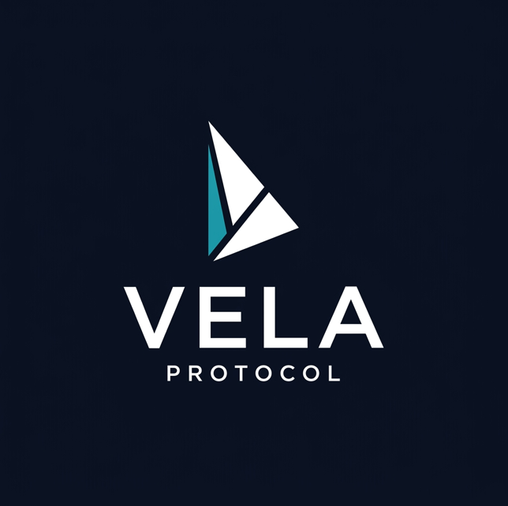

  
  <h1>Vela Protocol</h1>
  
<b>One token. Every RWA yield on Solana, auto-compounded.</b>

---

## Overview
Vela is a non-custodial RWA aggregator built on Solana for the Colosseum Frontier hackathon. 
By depositing USDC into Vela, users instantly mint `yUSDC` — a yield-bearing Token-2022 receipt. The protocol dynamically routes the underlying USDC across premium real-world asset issuers (like Ondo, BlackRock, and Hastra) to target a stable **5-6% APY base**.

If a higher-yield asset becomes volatile, Vela's keeper network automatically rotates capital back to Treasury safe havens, ensuring principal protection.

## Core Architecture
- **Program Derived Vaults:** Fully non-custodial. The smart contract escrows all assets.
- **Token-2022 Native:** `yUSDC` utilizes the Token-2022 standard for native transfer hooks and yield accrual.
- **Auto-Rotation:** Keeper bots monitor off-chain yields and execute on-chain rebalances to maintain the target APY.

## Local Development
*(Instructions will be added as the CLI/SDK is finalized)*
